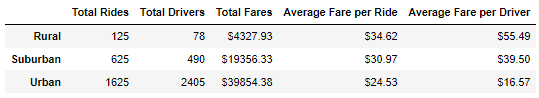
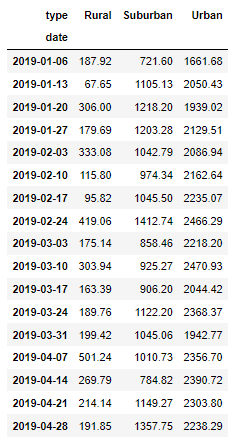
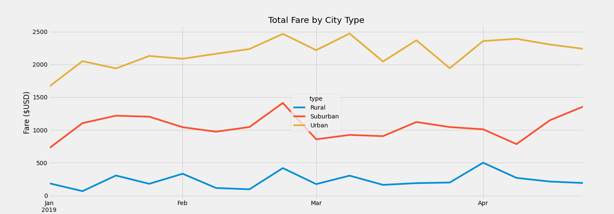

# PyBer Analysis

## Overview of the PyBer Fares
In this challenge assigned to Omar and I by V. Isualize was to take a look at the three city types of *urban, suburban,* and *rural* to check on how each one performs over the year. The two variables of considerable interest were of the __time of the year__ and the __daily fare total__ across the company. This data analysis could help increase the profit margins as well as efficiency in driver spreadout throughout the year. For this specific task, we were to only look at data from January through April.

## Results of the Data Analysis
From the first data sets given to derive our analysis from I first had to find how many *total drivers, rides,* and the *sum of all the fares*. First inspection of the information returned shows me that for both *rural* and *suburban* areas there were more rides given than drivers available. Whereas, within the *urban* environment there was a large surplus of drivers compared to rides given. This initial review shows an overabundance of drivers and thus reducing the *average fare per driver* because of it.

The lower the ratio of rides to drivers, the higher the *average fare per driver* will become. Though there are less rides overall within the *rural* and *suburban* areas, their average fares are much higher. Looking at *rural* alone, their *average fare per driver* is more than 3 times that of the *urban* drivers. The *average fare per ride* is also much higher within the *rural* and *suburban* areas, possibly due to the longer distances to each destination. These variables also cascade down to the averages as they boost *rural* and *suburban* areas.

With an overlook on a weekly basis of the first quarter of the year, there was a significant chunk of the data given still available. This shows how the *urban* fare totals overall were consistently outperforming the lower population density areas of *rural* and *suburban*. It was also more consistent in its return especially compared to the *suburbs* which had a large drop in the late stage of February. The constant use of PyBer in the *urban* area will give it an edge in profits made, though not when adding in expenses based on how many drivers there are. 

## Summary
There are a few business recommendations that I would propose in order to bring in more profits based on the data given. 
First, as discussed earlier, the amount of drivers to rides given is far too high to justify the average return. Cutting down the amount of drivers overall within the *urban* centers will increase the average fare per driver, thus also improving the amount in profits.

Second, would be looking into why exactly the *rural* and *suburban* areas have an edge on the average fare per driver/ride. As with the data given, a more concrete cause is not available. Distance could be a large factor as well as how long the rides were timewise. This could also include data on the amount of traffic each ride typically encounters.

Thirdly, would be to find more data on why certain weeks in the data have higher or lower total fares. More information on either national/local holidays as well as events could help in figuring it out so as to also adjust scheduling the many drivers for the busy and not so busy time periods.

